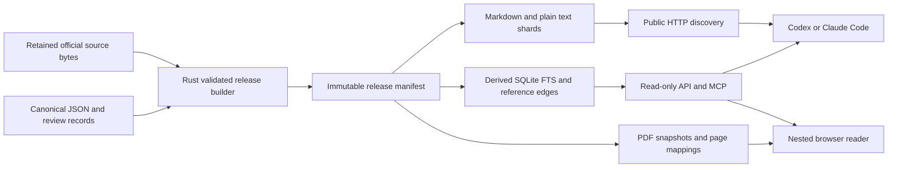

# Nested public reader and agent corpus access

## Purpose and observable outcome

A lawyer opens a Lex-Mex article inside a supported desktop browser or ordinary
web browser, sees its exact supporting PDF alongside it, and follows related
provisions without losing the original view. Codex or Claude Code retrieves
Markdown/plain text in the background from the same pinned release. A public
index declares complete or partial coverage and makes available text discoverable.

This is an implementation plan requested on 2026-10-06. Planning is complete;
reader, hosting, MCP, WebMCP, and SQLite implementation have not begun.
It does not authorize a DNS change or deployment. Local development and a
reviewable release candidate precede the eventual publication action.

## Authority, baseline, and existing work

Initial baseline: `8031ea11eb1d4ad88c046ba8b6ba1ed8851eb873`, with the audited
temporal repair pending its authorized local commit. The implementation baseline
must be recorded as that completed commit before work starts.
Repository instructions, canonical corpus, schemas, Rust code, and decisions
are authoritative. External websites are interaction references, not legal data.

Read `PLANS.md`, the temporal repair audit, the four-point report, and the
existing external CLI/metadata/ingestion plan. Reuse existing read-only
`instruments`, `path`, `search`, and bundle capabilities rather than inventing
a second corpus pipeline. Rust remains responsible for canonical publication;
the web UI and SQLite are derived consumers.

Existing Markdown exports contain source hashes and inject presentation links.
They are not an immutable public release or a byte-preserved PDF store. The
current source manifest has retrieval metadata but not a successful-upstream-
check ledger. No validated article-to-PDF page mapping was established here.
These are implementation prerequisites, not fields to guess.

## First release scope

Start with LRITF, IFPE-DCG-2021, ITF-DCG-2018, and LIC only if each satisfies
release gates. Expose a wider coverage catalogue with explicitly unavailable
article pages where necessary. The structural reader does not claim complete
historical validity or automatically accept temporal legal conclusions.

Proposed public nesting: `https://leg4ll4bs.com/lex-mex/`. Route and asset helpers
must honor a configurable base path. Root `/llms.txt` can point to
`/lex-mex/llms.txt` when the parent site owner integrates it. A subdomain deployment
remains an alternative if the existing host cannot support the needed routes;
inspect the actual site repository before choosing infrastructure.

## Architecture

Build once from a clean committed corpus selection. Generate a content-addressed
release manifest excluding its own digest field when computing its identifier.
Record Git commit, builder/schema versions, included instruments, coverage,
canonical/text/artifact hashes, source snapshot references, and review summary.
Pin all assets by release ID. Publish the mutable latest pointer only after the
complete candidate passes, retaining the previous pointer for rollback.

SQLite indexes instruments, provisions, source snapshots, typed edges, and
bounded review summaries. It must be rebuildable from the release, read-only
in serving, and contain no independent editorial authority. Delay SQLite if a
static bounded catalogue is sufficient for the first text-release milestone.

## Human interaction: nesting without losing context

Desktop layout: collapsible hierarchy; primary article; secondary source PDF.
A related provision opens in a comparison panel or replaces a selected panel,
with breadcrumbs and back navigation. Limit simultaneous comparison panels to
two; further navigation replaces the secondary panel. Compact layout uses
Article / Source / Related tabs with the same selection state.

Store `release_id`, instrument ID, provision ID, source digest, selected relation,
and validated PDF page in the shareable URL/state. Preserve user scroll and zoom
when an agent retrieves other text. An explicit "Show this evidence" action
changes the visible selection; a silent `get_provision` does not.

Use a same-origin HTML PDF viewer over retained PDF bytes. A bundled PDF.js
viewer is the preferred candidate for consistent controls; confirm its current
API/version during implementation. Native PDF embedding is a fallback, not an
assumed cross-host capability. Serve PDF with the correct media type and byte
range support; direct download remains available if inline rendering fails.
Never rely on a third-party live PDF iframe as the sole evidence view.

Acquire missing archived PDFs only from the official URL and require the bytes
to match the committed hash. If the live source differs, it is a new candidate
snapshot: keep the old release unsupported for inline source display until its
exact bytes are recovered, and label the new PDF separately. Do not change the
old manifest to make a fetched replacement fit.

PDF page mapping must be snapshot-specific. Extend the extracted-page pipeline
to map canonical spans to page indexes; validate boundaries and ambiguous matches.
Show a page jump only when mapping is verified. Otherwise open the instrument
PDF with search and say that automatic page location is unavailable.

## Public discovery and text contract

Proposed routes below are contracts to implement, not deployed endpoints.
Examples use an arbitrary release token `RELEASE_ID`; clients first resolve it
from the release catalogue and then use immutable URLs throughout a query.

| Route under `/lex-mex/` | Purpose |
|---|---|
| `llms.txt` | Small Markdown orientation, coverage and release links, usage guidance |
| `coverage.json` and `coverage.md` | Actual included instruments and independent stage states |
| `releases/latest.json` | Pointer to a fully validated immutable release |
| `releases/RELEASE_ID/manifest.json` | Digests, provenance and exact selection |
| `releases/RELEASE_ID/index.md` | Sharded instrument index |
| `releases/RELEASE_ID/mx/lritf/index.md` | Provision index and source links |
| `releases/RELEASE_ID/mx/lritf/articulo-1.md` | Article text with declared presentation links and metadata |
| `releases/RELEASE_ID/mx/lritf/articulo-1.txt` | Exact canonical provision body, UTF-8; metadata supplied separately |
| `releases/RELEASE_ID/sources/SHA256.pdf` | Exact retained source bytes |
| `reader?release=RELEASE_ID&instrument=lritf&provision=STABLE_ID` | Human nested view |
| `mcp` | Planned read-only Streamable HTTP service |

Keep `.txt` canonical body content distinct from linked Markdown presentation.
Metadata identifies language, stable IDs, source digest, retrieval/check dates,
release, coverage, review status, and missing evidence. Reuse existing filenames
where valid; don't assume numeric IDs cover Bis/suffixed articles or transitories.
Do not publish private reviewer notes or working artifacts; define a deliberately
public review summary before exposure.

HTML pages advertise their Markdown with `rel="alternate" type="text/markdown"`
and the applicable index with `rel="describedby"`. HTTP Link headers can provide
the same discovery for text responses. Publish a sitemap for human pages and
configure crawl policy deliberately. No access account or JavaScript execution
is needed to read public Markdown. Provide archive downloads and digest manifests
for offline clients, with bounded per-instrument shards instead of one forced
whole-corpus context dump.

`llms.txt` is a proposal and cannot guarantee automatic tool adoption. Offer
copyable instructions: fetch this index, select a release, search/navigate only
the relevant shards, cite stable IDs and source links. The site's root agent
index and GitHub README should link the public index once it exists. A future
optional agent skill may reinforce this workflow, but ordinary HTTP must work
without installation.

## MCP, browser tools, and desktop integration

MCP tools: `search_corpus`, `get_provision`, `get_context`, `get_source`,
`list_references`, and `compare_snapshots`. Inputs include release ID, stable
instrument/provision IDs, and bounded pagination. Outputs provide text, provenance,
coverage/uncertainty, source and viewer URLs. Invalid/unknown IDs return explicit
errors. `as_of` legal-validity queries remain unsupported until historical evidence
is implemented. Search relevance cannot create legal graph edges.

The server does not control a desktop browser simply because it returns a URL.
The host/agent opens the viewer using its browser capability. For optional live
synchronization, the top-level reader can expose read-only WebMCP retrieval plus
`get_reader_selection` and an explicit `show_evidence` UI action, using the same
release contract and state. Background retrieval never silently changes the view.
No canonical ingestion or review-resolution tools belong to this public surface.

OpenAI's current documentation says the built-in browser is in the ChatGPT
desktop app, not Codex CLI/IDE. It can display public/local pages. WebMCP tools
must be registered on the top-level page: the documented browser does not discover
iframe tools. Therefore register Lex-Mex tools on the reader shell even if PDF
rendering uses a nested frame. Availability depends on host/model/policy; feature
detection and ordinary HTTP/MCP fallbacks are required.

Claude Code documents remote HTTP MCP and a desktop Browser preview. Use a local
reader server for acceptance testing in that pane. Treat arbitrary public-page
preview, PDF rendering, and any shared-selection behavior as tests to execute,
not capabilities established by the documentation alone. CLI users can use a
separate ordinary browser with the same URLs. Codex must not edit Claude-owned
configuration or invoke its CLI; provide setup instructions for the operator.

The universal contract is text + viewer/source URLs + pinned release. It works
even when a host cannot embed an MCP UI. An optional MCP Apps widget can be
evaluated later for compatible hosts; it is not a prerequisite for public access.

## Milestones and acceptance gates

1. **Release/source foundation.** Implement a Rust release builder over an
   explicit corpus selection; retain/recover matching PDFs; declare missing
   snapshots. Acceptance: deterministic rebuild, all hashes check, human
   decisions preserved, no working/private files leaked, failed builds leave the
   previous release intact. Update schemas/types/fixtures together for new fields.
2. **Discoverable text release.** Generate indexes, coverage, immutable `.md` and
   `.txt`, manifests, and archives. Acceptance: no-JavaScript HTTP client follows
   index to an article, exact `.txt` body matches canonical text, Markdown links
   resolve within the published release, partial coverage is explicit.
3. **Nested reader candidate.** Build hierarchy/article/PDF/related panes and
   snapshot-specific page mappings. Acceptance: PDF digest matches manifest;
   unmapped articles have honest fallback; share/back navigation retains context;
   compact and keyboard views work; two-panel limit prevents window proliferation.
4. **SQLite and read-only MCP.** Build serving projection and bounded tools.
   Acceptance: HTTP, MCP, and reader agree on IDs/text/release; invalid IDs and
   unsupported historical queries are explicit; release swaps cannot mix content
   across a pinned session; corpus and reviews remain untouched by all reads.
5. **Desktop qualification.** Test the actual ChatGPT desktop built-in browser
   and operator-run Claude Desktop preview. Acceptance: human PDF remains visible
   while agent fetches multiple text articles; explicit show-evidence changes the
   pane; same digest/release throughout; unavailable WebMCP/inline PDF paths fall
   back cleanly. Record versions and results separately, not as a generic pass.
6. **Publication candidate.** Inspect LEG4L L4BS hosting integration; prepare
   base-path routes, atomic release promotion, cache rules, source-check ledger,
   and rollback. Local/preview evidence must be reviewable before deployment.
   Publication approval and authenticated hosting/DNS access are final inputs.

Run the repository's required checks for Rust/canonical changes. Add meaningful
release/route integration tests for the new boundary, rather than tests that only
mirror UI implementation. Use frozen exact-source fixtures for page mapping and
include repeated article labels, page furniture, and spanning articles.

## Freshness, operation, and stop conditions

Check official sources on a configured cadence. Record last attempt, last
successful check, HTTP metadata, and observed digest in a derived operational
ledger. New digest -> candidate ingestion -> validation/inspection -> new release.
Never automatically replace published text merely because the upstream file
changed. An unreachable source keeps its last verified snapshot and shows the
failed check. Retain DOF sources for formal amendment/commencement evidence.

Pause integration on unexplained source/text differences, lost human decisions,
unvalidated page locations, or missing exact PDF bytes presented as verified.
Workers can continue unrelated instruments. Do not autoapprove legal ambiguity.
Rollback changes the latest pointer to a retained known release, preserving history.

## Current checkpoint and next action

2026-10-06: repository exporter/manifest and prior consumer plan inspected;
official host/discovery documentation checked; this plan specifies a bounded
implementation and tests. No new serving code or external configuration written.

Next action: after the authorized repair commit, implement milestone 1 with an
explicit four-instrument selection and an inventory of recoverable exact PDFs.
Bind the active capsule to the applicable task plan and digest before implementation.

## Sources

- [llms.txt discovery proposal](https://llmstxt.org/): Markdown indexes and alternate links; not automatic adoption.
- [OpenAI built-in browser](https://learn.chatgpt.com/docs/browser): desktop shared page view and CLI/IDE distinction.
- [OpenAI Site tools](https://learn.chatgpt.com/docs/webmcp): top-level WebMCP, iframe limitation and availability conditions.
- [OpenAI Docs MCP](https://developers.openai.com/learn/docs-mcp): external read-only documentation MCP pattern.
- [Claude Desktop](https://code.claude.com/docs/en/desktop): local dev-server Browser preview.
- [Claude MCP](https://code.claude.com/docs/en/mcp): remote HTTP tool connections.
